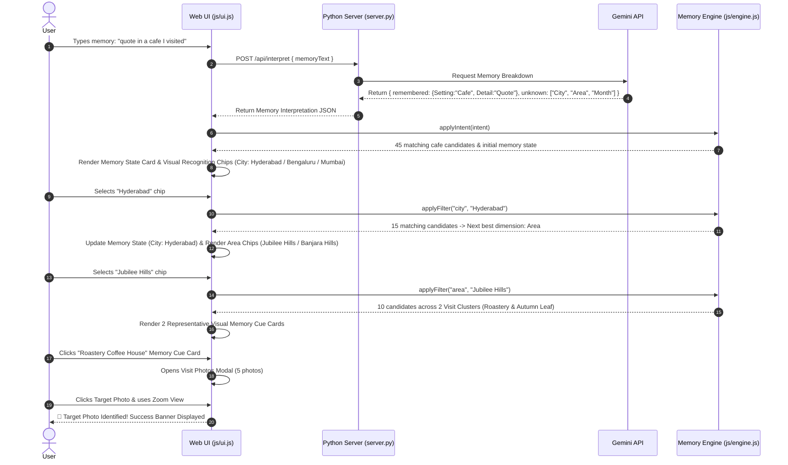

# System Architecture: AI-Guided Memory Reconstruction for Google Photos

---

## 1. System Overview & High-Level Architecture

The **AI-Guided Memory Reconstruction System** is designed to transform ambiguous, incomplete visual memories into precise target photo identification through **AI-guided visual memory reconstruction**.

Instead of relying on database filter panels or exact content search shortcuts, the system combines **Gemini-driven memory interpretation** (parsing `remembered` vs `unknown` memory state) with a **deterministic in-memory discriminator engine**, **context clustering**, and a **human recognition UI**.

### High-Level Architectural Diagram

```mermaid
graph TD
    subgraph Client Layer ["Client Layer (Web Application)"]
        UI_Input["Memory Text Input View"]
        UI_State["AI Memory State Breakdown Card (REMEMBERED vs UNKNOWN)"]
        UI_Chips["Dynamic Recognition Chips (Which place/time feels familiar?)"]
        UI_Clusters["Representative Visual Memory Cue Gallery"]
        UI_Grid["Active Candidate Photos Grid"]
        UI_Modal["Context Lightbox & Fine-Detail Image Zoom Modal"]
    end

    subgraph Backend Layer ["Backend Layer (Python Server)"]
        Server["Secure Retrieval Server (server.py at :8080)"]
        Gemini_Client["Gemini API Handler (gemini-flash-lite-latest)"]
        Fallback_Parser["Deterministic Memory Fallback Parser"]
    end

    subgraph Client Engine ["Client-Side Search Engine"]
        Engine["MemoryRetrievalEngine (js/engine.js)"]
        Dataset["In-Memory Dataset (data/photos_dataset.json - 48 Photos)"]
    end

    %% Flow Connections
    UI_Input -->|1. Raw Vague Memory ("quote in a cafe")| Server
    Server -->|2. Prompt Payload| Gemini_Client
    Gemini_Client -->|3. Memory Breakdown (remembered, unknown)| Server
    Gemini_Client -.->|On Error / No Key| Fallback_Parser
    Fallback_Parser --> Server
    Server -->|4. JSON Response {category, city, area, month, remembered, unknown}| UI_State
    UI_State -->|5. Apply Initial Intent| Engine
    Engine -->|6. Calculate Candidate Subset & Best Discriminator| UI_Chips
    UI_Chips -->|7. User Taps Recognition Chip (e.g. Hyderabad)| Engine
    Engine -->|8. Update Memory State & Candidate Set| UI_State
    Engine -->|9. Context Clusters & Representative Thumbnails| UI_Clusters
    UI_Clusters -->|10. User Taps Context Card (Roastery)| UI_Modal
    UI_Grid -->|Click Photo to Zoom| UI_Modal
    UI_Modal -->|11. Inspect Detail & Confirm Target Photo| UI_Input
```

---

## 2. Core Subsystems & Component Specifications

### 2.1 Gemini LLM Memory Interpreter & Intent Parser (`server.py`)
- **Technology:** Gemini API (`gemini-flash-lite-latest`, `gemini-3.1-flash-lite`, `gemini-3.8-flash`) with fallback handling.
- **Endpoint:** `POST /api/interpret`
- **Request Body:**
  ```json
  { "memoryText": "I remember a quote in a cafe" }
  ```
- **Response Schema (`MemoryInterpretationResponse`):**
  ```json
  {
    "venue_type": "cafe",
    "is_cafe_related": true,
    "city": null,
    "area": null,
    "month": null,
    "category": "cafe",
    "remembered": {
      "Setting": "Cafe",
      "Detail": "Quote"
    },
    "unknown": [
      "Where (City)",
      "Area / Neighborhood",
      "When (Month)",
      "Which Cafe"
    ],
    "reconstruction_prompt": "I see you're looking for a quote photo from a cafe! To help me find the exact memory, could you tell me which city, area, or month you visited this cafe?",
    "confidence_score": 0.8,
    "source": "gemini",
    "model_used": "gemini-flash-lite-latest"
  }
  ```

### 2.2 Dynamic Memory State & Discriminator Engine (`js/engine.js`)
- **Responsibility:** Maintain the evolving `remembered` object and `unknown` array while calculating partitioning entropy across candidate photos for candidate dimensions (`city`, `area`, `month`, `category`).
- **Entropy Algorithm:**
  1. For each unselected dimension $D \in \{\text{city}, \text{area}, \text{month}, \text{category}\}$, compute value frequencies across current candidates.
  2. Compute Shannon Entropy $H(D) = -\sum P(v_i) \log_2 P(v_i)$.
  3. Select dimension $D^*$ with highest entropy to generate the next recognition question.
  4. Generate choice chips from candidate subset plus `"Not sure"` and `"None of these"`.

### 2.3 Context Clustering & Representative Visual Cue Engine (`js/engine.js`)
- **Responsibility:** Group matching candidates by `visit_cluster_id` (e.g. 5 photos taken during one visit to *Roastery Coffee House*).
- **Representative Selection:** Selects the designated `is_representative` photo to serve as a visual memory cue card.
- **Benefit:** Allows users to recognize an entire visit environment at a glance without scrolling through repetitive photos.

### 2.4 Reconstruction UX & Lightbox Zoom View (`index.html`, `index.css`, `js/ui.js`)
- **Header Title:** *"Let's reconstruct the memory"*
- **Header Subtitle:** *"You don't need to remember everything. We'll work backwards from what you do remember."*
- **Memory State Card:** Glassmorphic panel displaying green `.remembered-col` badges and amber `.unknown-col` badges.
- **Lightbox Zoom Modal:** Interactive zoom viewer allowing users to zoom into background details (such as wall quotes) to confirm target photo identification.

---

## 3. Dataset Specifications (`data/photos_dataset.json`)

```typescript
interface PhotoRecord {
  id: string;                    // Unique identifier (e.g., "img_hyd_roastery_01")
  url: string;                   // Asset path (e.g., "images/roastery_wall_quote.jpg")
  title: string;                 // Human readable caption
  city: string;                  // e.g., "Hyderabad"
  area: string;                  // e.g., "Jubilee Hills"
  venue_name: string;            // e.g., "Roastery Coffee House"
  category: string;              // e.g., "cafe"
  month: string;                 // e.g., "March"
  date: string;                  // e.g., "2024-03-15"
  visit_cluster_id: string;       // e.g., "visit_roastery_march"
  is_representative: boolean;     // True if primary cluster thumbnail
  is_target_photo?: boolean;    // True for the specific wall quote target photo
}
```

---

## 4. End-to-End Sequence Diagram (Cafe + Quote Journey)



---

## 5. Technology Stack Summary

| Component | Technology Choice | Rationale |
|---|---|---|
| **Frontend UI** | HTML5, Vanilla JavaScript (ES6+), Vanilla CSS | Zero build overhead, instant rendering, high-performance DOM updates |
| **Design System** | Dark Mode, Glassmorphism, CSS Variables | Modern aesthetics, responsive grid, visual feedback |
| **Backend Server** | Python `http.server` (`server.py`) | Lightweight, zero-dependency proxy server handling Gemini API calls |
| **LLM Model** | Gemini 1.5 Flash / `gemini-flash-lite-latest` | Fast, structured JSON generation for memory state extraction |
| **Data Store** | In-Memory JSON (`data/photos_dataset.json`) | Fast sub-millisecond filtering across 48 photo records |
