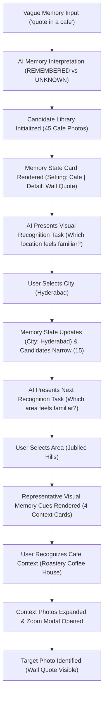

# Context Document: AI-Guided Memory Reconstruction for Google Photos

---

## 1. Executive Summary & Core Objective

### Objective
Build a functional AI-powered Minimum Viable Product (MVP) that assists users in retrieving a photo they remember through incomplete, vague visual fragments (e.g., city, area, month, setting) through an **AI-guided MEMORY RECONSTRUCTION** experience.

### Core Hypothesis
When users cannot precisely describe a remembered photo, an AI-guided sequence of recognition tasks can help them reconstruct the missing context backwards from what they do remember and retrieve the target photo with significantly less search effort.

### Core Philosophy
- **Reconstruction over Filtering:** Shift the interaction paradigm from database filtering to working backwards from remembered fragments to fill in missing context.
- **Visual Recognition Prompts:** Use representative visual Memory Cues derived dynamically from the library to trigger human recall.
- **Dynamic AI Guidance:** Determine the best next recognition task based on candidate partitioning entropy and missing memory dimensions.

---

## 2. Primary MVP Demonstration Scenario: "Cafe + Quote"

### Scenario Narrative
- **User's Vague Memory:** *"I remember seeing a quote on a wall in a cafe. I took a photo of it, but the quote was not the main subject of the photo. I visit many cafes and have many photos from them. I do not remember the quote, cafe name, area, or exact date."*
- **Target Photo Characteristics:** A broad cafe photograph where the wall quote is a secondary background element (`images/roastery_wall_quote.jpg`).
- **Retrieval Requirement:** The initial query returns all cafe candidate photos (45 photos), requiring the user to reconstruct context through visual recognition tasks (City -> Area -> Visit Context -> Target Photo).

### Intended Step-by-Step User Journey

---

## 3. General Retrieval Architecture & Mechanics

### Dynamic Memory State & Discriminator Engine
- Tracks `remembered` object (e.g. `{ Setting: "Cafe", Detail: "Wall Quote", City: "Hyderabad" }`) and `unknown` array (e.g. `["Area / Neighborhood", "When (Month)"]`).
- Evaluates remaining candidate entropy to select the best discriminator dimension (`city`, `area`, `month`, `category`).
- Formulates recognition chip choices directly from active candidates plus `"Not sure"` and `"None of these"`.

### User Experience Copy Strategy
- **Header:** *"Let's reconstruct the memory"*
- **Subtitle:** *"You don't need to remember everything. We'll work backwards from what you do remember."*
- **Sections:**
  - `REMEMBERED` chips (e.g. `Setting: Cafe`, `Detail: Wall Quote`)
  - `UNKNOWN / TO RECONSTRUCT` chips (e.g. `Where (City)`, `Area / Neighborhood`, `When (Month)`)
  - `Visual Memory Cues` ("Which place or moment feels familiar?")
- Strictly avoids metadata filtering copy ("Filter results", "Choose metadata", "Search by").

---

## 4. End-to-End MVP Technical Workflow

| Step | Stage | Description |
|---|---|---|
| **1** | **Memory Input** | Free-form text box accepting unformatted user memories. |
| **2** | **Memory Interpretation** | Gemini API parses memory input into structured intent, `remembered` fragments, `unknown` list, and `reconstruction_prompt`. |
| **3** | **Search Space Initialization** | In-memory dataset filtered strictly by structured dimensions (`category`, `city`, `area`, `month`). |
| **4** | **Memory State Render** | `#memoryStateCard` displays active REMEMBERED vs UNKNOWN badges. |
| **5** | **Recognition Task Presentation** | System displays dynamic recognition choice chips and representative Memory Cue cards. |
| **6** | **Progressive Narrowing** | User taps recognition chips, updating Memory State and reducing candidate counts. |
| **7** | **Context Drill-Down** | Tapping a recognized Memory Cue card opens the underlying visit photos. |
| **8** | **Zoom & Target Retrieval** | Interactive zoom modal allows inspecting wall quotes and confirming target photo identification. |

---

## 5. MVP Dataset Specifications

- **Source & Curation:** Curated 48 photo dataset (`data/photos_dataset.json`).
- **Target Photo:** `images/roastery_wall_quote.jpg` (Roastery Coffee House, Jubilee Hills, Hyderabad).
- **Distractors:** 44 cafe photos across 9 venues in Hyderabad, Bengaluru, Mumbai, and 3 non-cafe Hyderabad photos.
- **User-Facing Dimensions:** City, Area, Month, Category. Exact Time is removed.

---

## 6. Edge Case Safeguards

1. **`INVALID_INPUT`** (`"7="`, `"12345"`, empty): Prompt *"Tell me a little about what you remember about the photo."* No photos displayed.
2. **`UNSUPPORTED_SCENARIO`** (`"beach photo"`): Prompt *"This prototype currently demonstrates cafe memories."*
3. **`ZERO_MATCHES`** (`"cafe in Chennai"`): Message indicating zero photos found in prototype library with reset options.
4. **`REVERSIBILITY`**: Support `↩ Undo Choice` and `🔄 Reset All`.

---

## 7. Summary of Transformation

$$\text{Vague Memory Input} \xrightarrow{\text{Gemini State Parser}} \text{Memory State Card} \xrightarrow{\text{Visual Recognition Prompts}} \text{Progressive Reconstruction} \xrightarrow{\text{Context Recognition}} \rightarrow \mathbf{Target\ Photo\ Retrieved}$$
