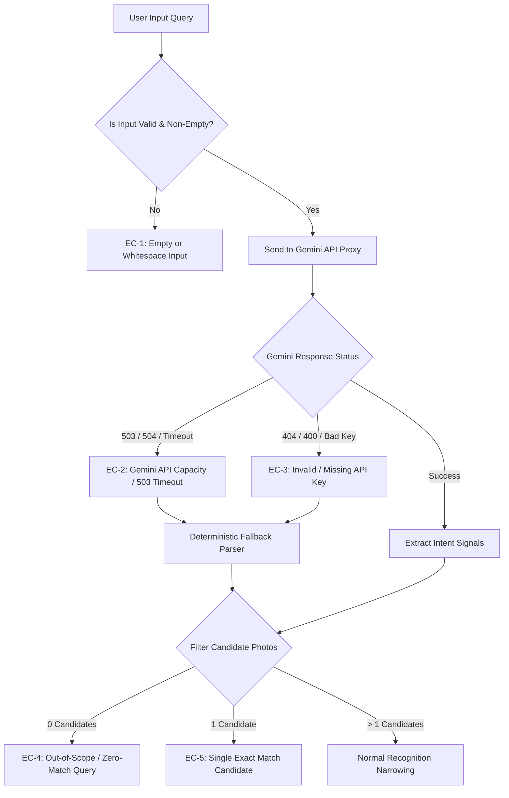

# Edge Case Specification & Handling Matrix

This document defines all edge cases, failure modes, input validation rules, and recovery mechanisms for the **AI-Guided Visual Memory Retrieval MVP**, built from [`context.md`](file:///Users/sreenidhitumu/Projects/GooglePhotosRetrievalMVP/context.md), [`architecture.md`](file:///Users/sreenidhitumu/Projects/GooglePhotosRetrievalMVP/architecture.md), and [`implementation_plan.md`](file:///Users/sreenidhitumu/Projects/GooglePhotosRetrievalMVP/implementation_plan.md).

---

## 1. Edge Case Classification & Architecture

---

## 2. Detailed Edge Case Matrix & Handling Strategies

### EC-1: Empty, Whitespace, or Gibberish Input
* **Trigger:** User submits an empty input box, punctuation only (`"..."`), or random gibberish (`"asdfghjkl"`).
* **Handling Strategy:**
  - Front-end validation prevents API calls for blank text.
  - Display helpful guidance: *"Please describe a visual memory (e.g. A quote in a cafe, a landmark visit, or coffee with friends)."*

---

### EC-2: Gemini API 503 / Capacity / Network Timeout Error
* **Trigger:** Google Gemini API returns `HTTP 503 Service Unavailable`, `504 Gateway Timeout`, or network request times out.
* **Handling Strategy:**
  - **Server-Side Retry Logic:** `server.py` executes automatic retries across alternative model endpoints (`gemini-3.8-flash`, `gemini-3.5-flash`, `gemini-flash-latest`) before falling back.
  - **Graceful Fallback Transition:** If all Gemini endpoints fail or time out, `server.py` seamlessly switches to the deterministic parser (`source: "fallback"`).
  - **UI Badge Feedback:** Update debug badge to `⚙️ INTERPRETATION: FALLBACK` with console logging explaining the capacity fallback.

---

### EC-3: Out-of-Scope / Zero-Match Query (Unrelated Input)
* **Trigger:** User enters a query completely absent from the photo library (e.g., *"Snowy mountains in Switzerland"*, *"Dog playing in snow"*).
* **Handling Strategy:**
  - Candidate count calculates dynamically to `0`.
  - **Zero Hardcoding Rule:** System never forces or hardcodes `"quote"` or `"cafe"`.
  - **Human-Centered Guidance Banner:** Render a friendly UI message:
    > *"I couldn't find any photos matching that memory in your library. Try exploring available locations, cafes, or landmarks below."*
  - **One-Click Recovery:** Surface a `"Explore Library Memories"` button that resets filters to show all curated context visual cues.

---

### EC-4: Single Exact Match Candidate ($N = 1$)
* **Trigger:** A query or combination of filter selections isolates exactly **1** matching photo.
* **Handling Strategy:**
  - Hide dynamic discriminator choice chips (no further partitioning needed).
  - Display conversational prompt: *"I found 1 exact photo matching your memory!"*
  - Render the single context card directly, allowing immediate drill-down to confirm the target photo.

---

### EC-5: Over-Constrained Filter Combination (User Rejection / Reversal)
* **Trigger:** User selects conflicting filters (e.g., `City: Hyderabad` + `Area: Indiranagar [Bengaluru Area]`) yielding 0 candidate photos.
* **Handling Strategy:**
  - Detect 0 candidate state immediately after selection.
  - Display message: *"No matching photos found with this combination."*
  - Highlight the **`↩ Undo Choice`** button to allow the user to easily step back to the previous valid candidate state.

---

### EC-6: Selection Reversal & "None of these" Chips
* **Trigger:** User clicks `"None of these"` or `"Not sure"` on a dynamic discriminator choice panel.
* **Handling Strategy:**
  - `"Not sure"`: Bypasses filtering on that specific dimension and presents the next best discriminator dimension.
  - `"None of these"`: Excludes the currently displayed choice values from the candidate set and recalculates remaining context clusters.

---

## 3. Implementation Verification Checklist

- [x] Front-end input validation preventing empty/blank query submits.
- [x] Multi-model backend retries in `server.py` to prevent 503 capacity failures.
- [x] Graceful fallback parser execution with `source: "fallback"` tag.
- [x] Dynamic candidate count evaluation ($N=0$, $N=1$, $N>1$) without hardcoded strings.
- [x] Zero-match UI banner with reset/explore recovery button.
- [x] Reversibility/Undo state preservation on all filter chips.
