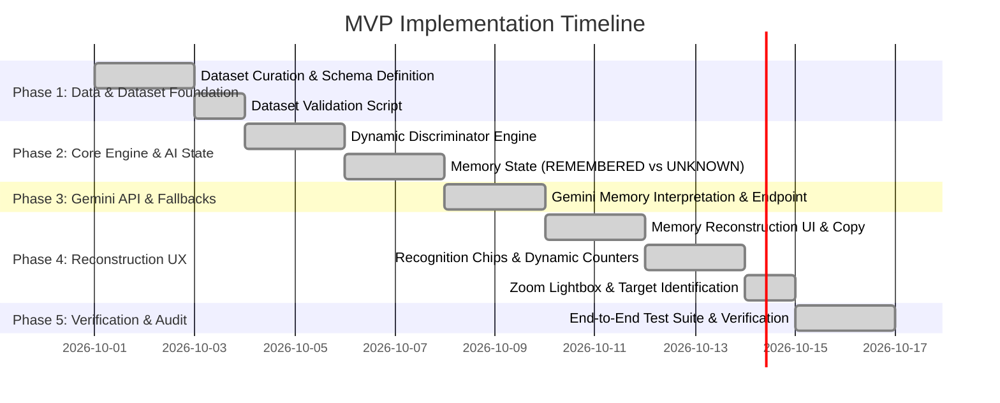

# Implementation Plan: AI-Guided Memory Reconstruction MVP

---

## Core Product Hypothesis

> **"When users cannot precisely describe a remembered photo, an AI-guided sequence of recognition tasks can help them reconstruct the missing context backwards from what they do remember and retrieve the target photo with less effort."**

*All engineering choices, UX copy, and architecture in this plan directly serve this core hypothesis.*

---

## Key Principles & Scope Boundaries

1. **Curated Dataset (No User Export Required):** 48 real-looking public image assets. Includes multiple cafe visits/contexts, multiple photos per context, and non-cafe distractors. Cafe names and attributes exist **only as metadata** in `data/photos_dataset.json`.
2. **Single Polished Scenario ("Cafe + Quote"):** Target photo is a broad cafe scene with a background wall quote (at *Roastery Coffee House*, Jubilee Hills, Hyderabad). The word "quote" is treated strictly as a memory fragment, **never as an OCR or content search shortcut** to bypass recognition.
3. **AI Memory Model (REMEMBERED vs UNKNOWN):** System tracks explicit memory state breakdown (`remembered` object and `unknown` array). The UI displays these fragments dynamically to anchor the memory reconstruction experience.
4. **Dynamic AI-Guided Narrowing:** Discriminator tasks (City, Area, Month, Category) are selected dynamically based on candidate partitioning entropy and missing memory dimensions. Supports `"Not sure"`, `"None of these"`, selection reversal (Undo), and Reset.
5. **Memory-Guided UX Copy:** Header Title: *"Let's reconstruct the memory"*, Subtitle: *"You don't need to remember everything. We'll work backwards from what you do remember."*. Replaces database filter jargon with human recognition prompts: *"Which place or moment feels familiar?"*, *"Which location (city) feels familiar?"*.
6. **Gemini Integration:** Gemini acts as an AI Memory Interpreter, parsing vague prompts, populating `remembered` and `unknown` memory states, and providing friendly reconstruction prompts. Server and client fallbacks ensure resilience.
7. **Strict Edge Case Scenarios:** Explicitly distinguishes between `INVALID_INPUT` (e.g., `"7="`, `"12345"`), `UNSUPPORTED_SCENARIO` (e.g., `"beach photo"`), `ZERO_MATCHES` (e.g., `"cafe in Chennai"`), and `VALID_CAFE_QUERY`.

---

## Plan Overview & Phase Timeline

---

## Phase 1: Dataset Curation & Precomputation Pipeline

### Tasks
- [x] **1.1 Asset Curation (48 Photos):**
  - **Target Photo:** Broad cafe photo with background wall quote at *Roastery Coffee House*, Jubilee Hills, Hyderabad (`images/roastery_wall_quote.jpg`).
  - **Cafe Context Distractors:** 44 cafe photos across 9 distinct venues in Hyderabad, Bengaluru, and Mumbai.
  - **Hyderabad Non-Cafe Distractors:** 3 non-cafe photos (monuments/streets) for realistic ambiguity.
- [x] **1.2 Metadata JSON Schema (`data/photos_dataset.json`):**
  - Metadata fields per item: `id`, `url`, `title`, `city`, `area`, `venue_name`, `category`, `month`, `date`, `visit_cluster_id`, `is_representative`, `is_target_photo`.
- [x] **1.3 Dataset Validation Script:**
  - `scripts/validate_dataset.py` verifying target photo presence and metadata completeness.

---

## Phase 2: Core Dynamic Discriminator & Memory State Engine

### Tasks
- [x] **2.1 In-Memory Filter Engine (`js/engine.js`):**
  - Structured metadata evaluation on `city`, `area`, `month`, `category`.
  - Dynamic entropy scoring to choose the optimal next discriminator dimension.
- [x] **2.2 Dynamic Memory State Management:**
  - Maintains `remembered` key-value pairs and `unknown` array of missing memory fragments.
  - Updates memory state as the user selects recognition chips or visual context cues.
- [x] **2.3 Context Clustering & Memory Cue Selector:**
  - Groups candidates by `visit_cluster_id`.
  - Selects representative thumbnail for visual memory cue presentation.

---

## Phase 3: Gemini Memory Interpretation & Backend API

### Tasks
- [x] **3.1 Gemini API Proxy (`server.py`):**
  - Secure server running at `http://localhost:8080`.
  - Sends vague text memory to Gemini API (`gemini-flash-lite-latest`).
  - Returns `venue_type`, `category`, `is_cafe_related`, `city`, `area`, `month`, `remembered`, `unknown`, `reconstruction_prompt`.
- [x] **3.2 Server & Client Fallback Resilience (`js/llm.js`):**
  - Deterministic parser fallback if Gemini API is unreachable or key is unconfigured.

---

## Phase 4: Memory Reconstruction UX Development

### Tasks
- [x] **4.1 Memory Reconstruction Layout (`index.html`, `index.css`):**
  - Header: *"Let's reconstruct the memory"*, Subtitle: *"You don't need to remember everything. We'll work backwards from what you do remember."*.
  - Glassmorphic `#memoryStateCard` displaying `.remembered-col` and `.unknown-col`.
- [x] **4.2 Recognition Chips & Choice Panels (`js/ui.js`):**
  - Dynamic generation of recognition chips from active candidate subset.
  - Dimension selection chips (`📍 City`, `🏙️ Area`, `📅 Month`, `☕ Category`).
- [x] **4.3 Lightbox Modal with Zoom Controls:**
  - High-resolution image zoom modal with Zoom In/Out/Reset controls for inspecting fine scene details.

---

## Phase 5: Verification & End-to-End Scenario Polish

### Tasks
- [x] **5.1 End-to-End Journey Verification:**
  - Input: *"quote in a cafe I visited"* -> AI extracts `{ Setting: "Cafe", Detail: "Wall Quote" }` -> returns 45 broad cafe candidates.
  - User recognizes **Hyderabad** -> Candidate set narrows to 15 cafe photos across Hyderabad.
  - User recognizes **Jubilee Hills** -> Candidate set narrows to 10 photos across Roastery and Autumn Leaf.
  - User recognizes **Roastery Coffee House** Memory Cue -> opens 5 visit photos.
  - User identifies target photo with wall quote -> Success banner triggered!
- [x] **5.2 Reversibility & Edge Case Test Suite:**
  - `test_memory_input_cases.py`, `test_quote_rejection.py`, `test_target_prevention.py`, `test_four_dimensions.py`, `test_memory_reconstruction.py`.

---

## Implementation Phase Matrix

| Phase | Component | File(s) | Focus |
|---|---|---|---|
| **Phase 1** | Data Foundation | `data/photos_dataset.json`, `scripts/validate_dataset.py` | 48 photos, target image & metadata |
| **Phase 2** | Dynamic Engine & State | `js/engine.js` | Entropy-based discriminator & memory state |
| **Phase 3** | LLM API & Fallback | `server.py`, `js/llm.js` | Gemini memory parser & fallback |
| **Phase 4** | Reconstruction UX | `index.html`, `index.css`, `js/ui.js` | Memory state card, recognition chips, zoom lightbox |
| **Phase 5** | Test Verification | `scripts/test_*.py` | Automated test suite verifying complete flow |
